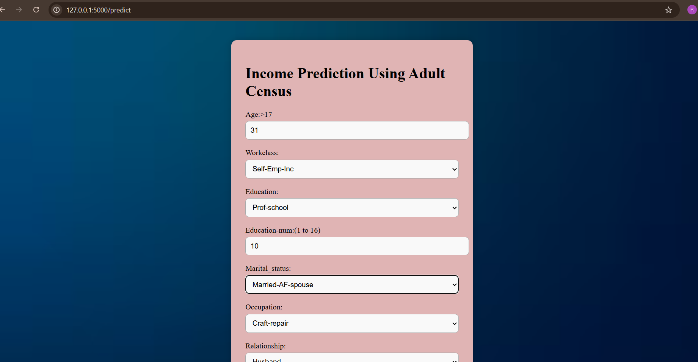
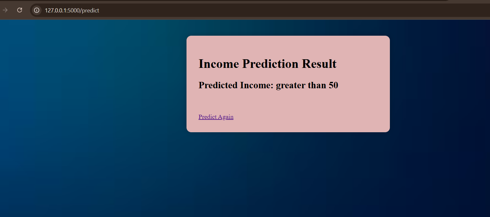

## Adult Income Prediction

## Project Overview

Income level is an important socio-economic indicator that influences quality of life, access to resources, and financial planning. Predicting whether an individual earns more than 50K per year is challenging due to the complex interplay of demographic, educational, and occupational factors. Developing an effective machine learning model can help identify patterns and key factors affecting income, enabling better socio-economic analysis and decision-making.

## Objective

The main objective of this project is to develop an accurate and efficient classification model to predict whether an individual earns more than 50K per year based on demographic, educational, and occupational attributes. The goal is to identify patterns and factors that influence income, which can help in decision-making.

## Features

* Machine Learning model trained using Adult dataset
* User-friendly web form for input
* Automatic preprocessing (log transform + label encoding)
* Real-time prediction
* Responsive UI with CSS

## Technologies Used

* Programming -- Python
* ML Libraries -- Pandas, NumPy, Scikit-learn
* Web Framework -- Flask
* Frontend -- HTML, CSS
* Deployment Model -- Pickled ML Model

## Project Structure
├── static

│   ├── css

│   │   └── style.css  # Web styling

│   ├── images  # Background images

│   │   ├── adult_Webpage.png  #Output screenshot

│   │   ├── adult_Webpage_prediction_output.png  #Output screenshot

│   │   └── bg2.jpg  

├── templates

│   ├── index.html  # User input form

│   │   └── output.html #Prediction result

├── app.py   # Flask application

├── model.py

├── README.md

├──adult.csv

└──Different pkl files(Trained,scalar,encorded)

## Dataset Description

 Source:

- The dataset is obtained from the UCI Machine Learning Repository (Adult dataset).

- Available in CSV format as adult.data

 Features:

- The dataset contains the following features:

Age	-- Age of the individual in years

Workclass -- Type of employment 

Final sampling weight -- Final sampling weight (used for survey purposes)

Education -- Highest level of education completed

Education-num -- Number of years of education

Marital-status -- Marital status (Married, Divorced, Never-married, etc.)
Occupation  -- Type of occupation (Tech-support, Sales, Exec-managerial, etc.)

Relationship -- Family relationship (Husband, Wife, Not-in-family, etc.)

Race -- Race of the individual

Sex -- Gender of the individual (Male, Female)

Capital-gain -- Capital gains in USD

Capital-loss -- Capital losses in USD

Hours-per-week --  Number of hours worked per week

Native-country -- Country of origin

Target Variable:

Income – Binary variable indicating whether the individual earns:

- Low income - <=50K 

- High income - >50k

(Note:Unwanted columns like final weight sampling and race are removed)

## Quick Start

- Frontend

Develop HTML page for user input

- Bakend

- Import Required Libraries

Pandas, NumPy

Scikit-learn (Model training, preprocessing, evaluation)

Pickle (saving encoded,scaled,trained model)

Flask (Web deployment - for final model)

- Load the Adult Census Income Dataset

Import dataset from UCI Repository / local CSV file

- Data Preprocessing

Handle missing 

Remove duplicates

Encode categorical variables using Label Encoding / OneHot Encoding

Feature scaling using StandardScaler

Split into X (independent features) and y (target: income ≤50K / >50K)

Train-test split using train_test_split

Apply Classification Models & Evaluate Performance

- Train multiple models:
1️ Logistic Regression

2️ Decision Tree Classifier

3️ Random Forest Classifier

4️ Support Vector Machine (SVM)

5️ XGBoost / Gradient Boosting (optional)

Evaluate:

Accuracy Score

Identify:

Best-performing model

- Save Model & Encoders

Save final selected model using pickle

Save encoders and scaler for later prediction

- Deployment (Flask Web App)

Create Flask backend to load trained model

Predict income and display result on webpage

- Run the Flask App

- Open the browser using api

## Output

- Provide user inputs and check predicted income category

- less than and equal or greater than to 50k

## Author

Raseesa Shaheem

